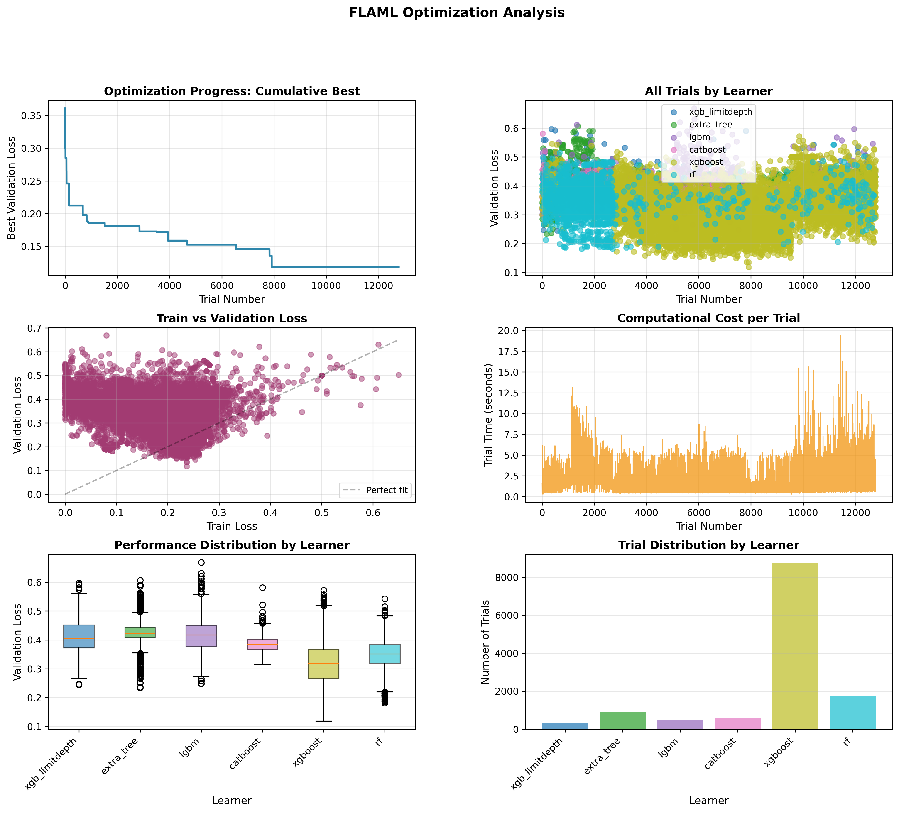
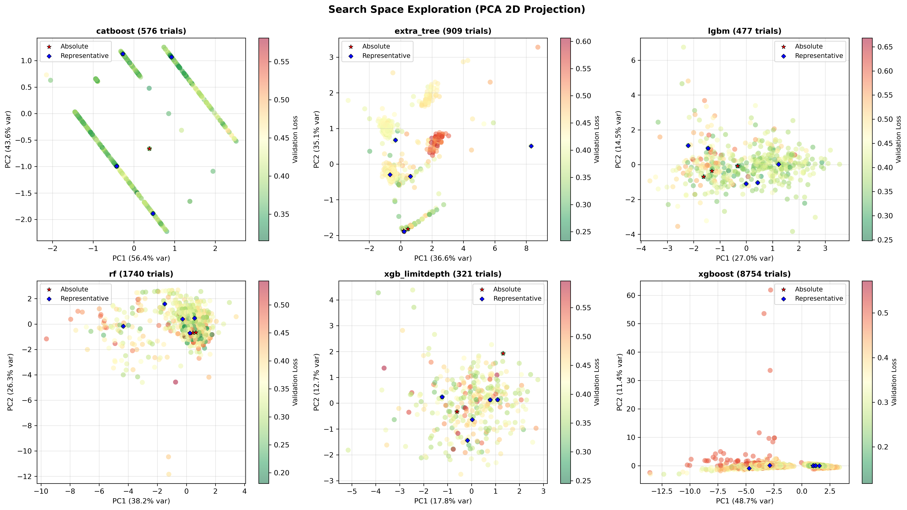

# flaml-analyze

Extract and analyze best configurations from [FLAML AutoML](https://github.com/microsoft/FLAML) optimization logs.

## Overview

[](https://doi.org/10.5281/zenodo.17987939) [](https://github.com/filipsPL/flaml-log-analyze/actions/workflows/test.yml)

This tool processes FLAML optimization logs to:
- Extract best configurations for each learner (algorithm)
- Generate two types of warm start configurations:
  - **Absolute**: Pure top-N by performance
  - **Representative**: Diverse best-per-cluster selections
- Visualize the search space exploration
- Provide detailed optimization statistics

## Sample outputs


#### Optimization summary



#### Search space visualization




#### Performance report

```
================================================================================
FLAML OPTIMIZATION SUMMARY
================================================================================

OVERALL STATISTICS
--------------------------------------------------------------------------------
Total trials: 12777
Best validation loss: 0.118131
Worst validation loss: 0.668284
Mean validation loss: 0.338847
Std validation loss: 0.075695
Total wall clock time: 21599.62 seconds (359.99 minutes)
Mean trial time: 1.69 seconds

LEARNER STATISTICS
--------------------------------------------------------------------------------
Learner         Trials     Best Loss       Mean Loss
--------------------------------------------------------------------------------
catboost        576        0.315344        0.387085
extra_tree      909        0.233602        0.425164
lgbm            477        0.248275        0.419497
rf              1740       0.180855        0.348641
xgb_limitdepth  321        0.245129        0.411951
xgboost         8754       0.118131        0.317687
...
```

#### Warm-start parameters for the next FLAML round

```python
warm_start_configs = {
    # Top 5 configurations for catboost
    'catboost': [
        {"early_stopping_rounds":10,"learning_rate":0.14189952377559728,"n_estimators":8192,"FLAML_sample_size":49659},  # Rank 1: metric=0.315344
        {"early_stopping_rounds":11,"learning_rate":0.1530902242854414,"n_estimators":8192,"FLAML_sample_size":10000},  # Rank 2: metric=0.316097
        {"early_stopping_rounds":12,"learning_rate":0.09541333025917802,"n_estimators":8192,"FLAML_sample_size":49659},  # Rank 3: metric=0.320287
        {"early_stopping_rounds":10,"learning_rate":0.09544104526717777,"n_estimators":8192,"FLAML_sample_size":49659},  # Rank 4: metric=0.320287
        {"early_stopping_rounds":10,"learning_rate":0.09541180730499482,"n_estimators":8192,"FLAML_sample_size":49659},  # Rank 5: metric=0.320287
    ]
}
```

## Requirements

### Python Version
- Python 3.7+

### Dependencies
```bash
pip install numpy scikit-learn matplotlib
```

All dependencies are standard packages, no special installations needed.

## Quick Start

### Basic Usage
```bash
./flaml-analyze.py path/to/optimization.log
```

This will:
1. Parse the FLAML log file
2. Extract top 5 configs per learner (absolute + representative)
3. Generate visualizations and summaries
4. Save warm start configurations

### Common Options
```bash
# Extract top 10 configs per learner
./flaml-analyze.py optimization.log --warm-start-per-method 10

# Adjust performance filtering (keep top 30% before clustering)
./flaml-analyze.py optimization.log --performance-percentile 30

# Save to specific directory
./flaml-analyze.py optimization.log -o results/

# Extract top 3 for analysis summary
./flaml-analyze.py optimization.log -n 3
```

## Output Files

The script generates:

1. **`warm_start_configs_absolute.py`**
   - Pure top-N configurations ranked by performance
   - Use for maximum performance and fast convergence

2. **`warm_start_configs_representative.py`**
   - Diverse configurations (K-Means + best per cluster)
   - Use for exploration and robustness

3. **`search_space_2d.png`**
   - PCA 2D projection showing search space exploration
   - Visualizes where FLAML searched and selected configs

4. **`optimization_analysis.png`**
   - Temporal progress plots
   - Shows optimization convergence over time

5. **`optimization_summary.txt`**
   - Detailed statistics and best configurations
   - Text report of the optimization run

## Command-Line Arguments

```
positional arguments:
  log_file              Path to FLAML log file (JSON lines format)

options:
  -n N_BEST             Number of best configs for analysis summary (default: 1)
  -o OUTPUT_DIR         Output directory (default: same as log file)
  --warm-start-per-method N
                        Number of configs per method for warm start (default: 5)
  --warm-start-overall N
                        Number of best overall configs (default: 5, currently unused)
  --performance-percentile X
                        Keep top X% before clustering (default: 20.0)
```

## Configuration Selection Strategies

### Absolute Top-N
- **Method**: Simply select the N best configurations by validation loss
- **Pros**: Guaranteed best performance, fast convergence
- **Cons**: Configurations may be very similar (redundant)
- **Use when**: Short optimization time, known good region

### Representative (K-Means + Best per Cluster)
- **Method**: 
  1. Filter to top 20% by performance
  2. Cluster into K groups using K-Means
  3. Select best performer from each cluster
- **Pros**: Diverse exploration, best-in-region configs, robust
- **Cons**: Slightly lower initial performance than absolute
- **Use when**: Medium/long optimization time, exploration needed

## Using Warm Start Configs

### Load and Use in FLAML
```python
# Load the configurations
exec(open('warm_start_configs_representative.py').read())

# Extract configs for a specific learner
catboost_configs = warm_start_configs['catboost']

# Use in FLAML (format depends on FLAML version)
# Option 1: Direct warm start
automl = AutoML()
automl.fit(
    X_train, y_train,
    task='classification',
    starting_points={'catboost': [c for c in catboost_configs]},
    time_budget=3600
)

# Option 2: As initial points
points_to_evaluate = [
    (config, learner) 
    for learner, configs in warm_start_configs.items() 
    for config in configs
]
```

## Examples

### Example 1: Basic extraction
```bash
./flaml-analyze.py logs/dataset1__descriptors_flaml.log
```
Output: 5 absolute + 5 representative configs per learner

### Example 2: More diverse configs
```bash
./flaml-analyze.py logs/optimization.log \
    --warm-start-per-method 10 \
    --performance-percentile 30
```
Output: 10 configs per learner, selected from top 30%

### Example 3: Aggressive filtering
```bash
./flaml-analyze.py logs/optimization.log \
    --warm-start-per-method 5 \
    --performance-percentile 10
```
Output: 5 configs per learner, selected from top 10% (best quality)

### Example 4: Analysis with custom output
```bash
./flaml-analyze.py logs/optimization.log \
    -n 10 \
    -o analysis_results/
```
Output: Analysis shows top 10, warm start saves 5 (default), all in analysis_results/

## Tips

### Choosing the Right Settings

**For short FLAML runs (<100 trials per learner):**
```bash
--warm-start-per-method 3 --performance-percentile 30
```
Keep more configs, be less aggressive

**For long FLAML runs (>500 trials per learner):**
```bash
--warm-start-per-method 5 --performance-percentile 10
```
Can be more selective, quality is high

**For exploration:**
```bash
--warm-start-per-method 10 --performance-percentile 20
```
More diverse starting points

**For exploitation:**
```bash
--warm-start-per-method 3 --performance-percentile 5
```
Focus on best-known region


## Advanced Usage

### Disable warm start generation
```bash
./flaml-analyze.py log.txt \
    --warm-start-overall 0 \
    --warm-start-per-method 0
```

### Analyze only (minimal configs)
```bash
./flaml-analyze.py log.txt -n 10 \
    --warm-start-per-method 1
```

## Algorithm Details

### Representative Selection
1. **Performance filtering**: Keep top X% (default: 20%)
2. **K-Means clustering**: Group into K clusters
3. **Best per cluster**: Select champion from each cluster
4. **Result**: K diverse, high-performing configurations

### Known issues

- Encoding of Categorical Variables before PCA and clustering using LabelEncoder. The Issue: LabelEncoder assigns arbitrary integers (0, 1, 2). K-Means treats these as continuous distances. The PCA projections and clusters for categorical hyperparameters may be slightly distorted.


## Version History

- **v0.1.2**: K-Means + best per cluster approach
- **v0.1.0**: Added PCA 2D visualization
- **v0.0.1**: Initial release with absolute/representative selection
